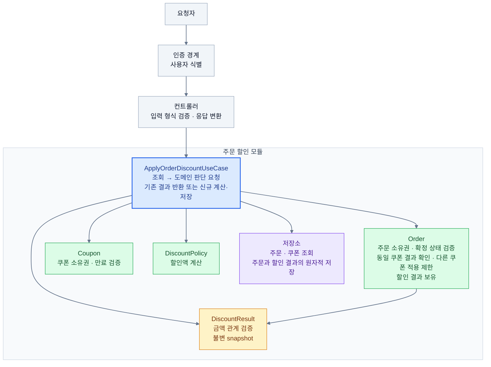

# 주문 할인 계약

## 1. 기준 문장과 요구 분류

> 구매자는 주문 확정 전에 보유 쿠폰을 적용할 수 있고, 확정된 할인 금액은 나중에 바뀌지 않아야 한다.

출처: 제공된 학습 본문과 W1 Action Quest. 아래 API 응답과 책임 경계는 이번 실습의 설계안이며, 실제 제품의 확정 정책과 구분한다.

### 확인된 사실

- **INV-001:** 구매자는 확정 전 자신의 주문에 자신이 보유한 쿠폰을 적용
- **INV-004:** 주문 확정 뒤 할인 금액은 정책이 바뀌어도 유지

### 실습 조건

- **INV-002:** 주문 전체에 쿠폰 한 장만 적용
- **INV-003:** `finalAmount = originalAmount - discountAmount`, `0 ≤ discountAmount ≤ originalAmount`, 할인액은 0과 원금 사이.
- **INV-005:** 같은 주문·쿠폰 재요청은 저장된 결과를 돌려주고 효과를 늘리지 않음
- **INV-006:** 만료 여부는 요청 시작 시각으로 판단

### 제품 담당자에게 물을 질문

| 질문 | 답에 따라 바뀌는 것 |
| --- | --- |
| 주문 취소 시 쿠폰을 복구하는가? | 쿠폰 상태와 재사용 가능 여부 |
| 종류와 무관하게 주문당 한 장인가? 품목별 적용이나 교체도 가능한가? | 적용 단위, 저장 구조, 중복 적용 응답 |
| 적용 제외 품목·카테고리가 있는가? | 할인 대상 금액과 적용 불가 사유 |
| 포인트와 쿠폰 중 무엇을 먼저 적용하는가? | 할인 기준액과 최종 금액 |
| 같은 명의의 다른 계정도 주문·쿠폰을 공유할 수 있는가? | 소유권과 접근 권한 |

답변 전에는 취소·복구, 쿠폰 교체, 포인트, 계정 공유를 범위에서 제외하고, 제외 품목이 없는 실습 데이터로 진행한다. 이는 실제 제품 정책이 아닌 임시 범위다.

## 2. 규칙과 반례

ID | 출처 | 깨지는 입력·상태 | 기대 결과 | 책임 후보 |
| --- | --- | --- | --- | --- |
| INV-001 | 제품 약속 | 다른 사용자의 주문 또는 쿠폰으로 요청 | 404, 상태 변경 없음 | 인증 경계·적용 서비스 |
| INV-002 | 실습 조건 |  쿠폰 적용 주문에 쿠폰2 추가 요청 | 409, 기존 쿠폰 결과 유지 | 주문·저장소 |
| INV-003 | 실습 조건 | 원금 10,000원에 할인액 -1원 이하 또는 10,001원 이상 | 저장 거절. 0원과 10,000원 할인은 허용 | 금액·할인 결과 담당 객체 |
| INV-004 | 제품 약속 | 10% 할인으로 확정 후 정책을 20%로 변경 | 기존 할인액과 최종 금액 유지 | 주문·결과, snapshot |
| INV-005 | 실습 조건 | 같은 주문·쿠폰 요청을 재전송하거나 동시에 요청 | 200, 저장된 동일 결과 반환, 추가 적용 없음 | 적용 서비스·저장소 |
| INV-006 | 실습 조건 | 쿠폰 만료 전 수신했지만 만료 처리 | 송신 시각 기준으로 유효 판정 | 요청 진입 경계·쿠폰 정책

## 3. 외부 API 계약
- **Method·Path:** `POST /api/v1/orders/{orderId}/discount`
- **사용자 식별:** `X-USER-ID`로 사용자 식별
- **Request:** `{"couponId": 2001}` — 사용자가 보유한 쿠폰 한 장의 ID
- **Success:** `200 OK` 리턴

# 성공 코드

| HTTP | 코드 의미 | 
| --- | --- | 
| 200 OK| 요청 성공 |
| 201 Create| 주문 성공 |
| 202 Accepted| 주문 접수, 처리 중 |
| 204 No Content| 주문 취소 완료 |

# 실패 코드
| HTTP | 오류 의미 | 요청자 행동 |
| --- | --- | --- |
| 400 | ID 형식 및 잘못된 값 요청 | 사용자 입력 수정 |
| 401 | 인증되지 않은 사용자의 요청 | 인증 후 재요청 |
| 403 | 자신의 소유가 아닌 요청 | 인증 후 재요청, 주문 재 조회 |
| 404 | 내용이 없거나 잘못된 URL | 자신의 주문·쿠폰 재조회 |
| 409 | 요청 내용이랑 현재 상태랑 충돌 | 기존 결과 확인 |
| 422 | 신규 적용 요청 시 쿠폰 만료 | 다른 쿠폰 선택 |
| 500 | 내부 처리 실패 | 동일 요청 재시도 |

## 4. 내부 경계: 선택과 대안

요청자는 `applyDiscount(couponId)`를 호출한다. 주문 변경 모듈은 사용 가능 판정, 할인 계산, 결과 저장과 금액 규칙을 책임진다.



| 구성 요소 | 판단하거나 책임지는 것 |
| --- | --- |
| **UseCase** | 호출 순서, 판단 결과에 따른 흐름 분기, 트랜잭션 조율 |
| **Order** | 누구의 주문인지, 신규 적용 가능한지, 같은 쿠폰의 기존 결과가 있는지 |
| **Coupon** | 누구의 보유 쿠폰인지, 요청 시작 시각에 유효한지 |
| **DiscountPolicy** | 주어진 원금·정책 조건으로 할인액 계산 |
| **DiscountResult** | 할인액 범위와 최종 금액 검증·보존 |
| **저장소** | 조회·저장, 동시 요청에서도 중복 적용 방지 지원 |

| 결정 | 선택과 이유 | 버린 대안 |
| --- | --- | --- |
| 오류 구분 | 호출자가 다음 행동을 판단할 수 있게 응답값 구분 | 모든 실패를 400으로 반환 |
| 결과 보존 | 성공 결과를 snapshot으로 저장한다. 재요청과 정책 변경에도 결과를 유지한다. | 요청마다 최신 정책으로 재계산 |
| 내부 경계 | 적용 서비스가 처리 순서를 숨긴다. 컨트롤러는 한 번의 호출로 사용한다. | 컨트롤러가 검증·계산·저장 순서를 직접 관리 |

## 5. 관찰 및 회귀 검증

| 기존 API 입력 | HTTP status | meta.result | error code | data 유무 |
| --- | --- | --- | --- | --- |
| 정상 숫자 ID | 미확인 | 미확인 | 미확인 | 미확인 |
| 숫자가 아닌 `abc` | 미확인 | 미확인 | 미확인 | 미확인 |
| 없는 숫자 ID | 미확인 | 미확인 | 미확인 | 미확인 |
| 미매핑 URL | 미확인 | 미확인 | 미확인 | 미확인 |

```bash
./gradlew :apps:commerce-api:test --tests '*ExampleV1ApiE2ETest'
./gradlew :apps:commerce-api:test --tests 'com.loopers.interfaces.api.ContractClassificationTest'
./gradlew :apps:commerce-api:test
 git diff --name-only HEAD -- apps/commerce-api/src/main
```

- [ ] Guide 기준 커밋 확인
- [ ] 세 테스트 실행 모두 테스트 0개·skip 없이 성공
- [ ] 위 관찰 표에 실제 값 기록
- [ ] 제품 코드 diff가 비어 있고 신규 제품 파일도 없음 확인
- [ ] 계약 문서와 새 관찰 테스트 외 변경 없음 확인